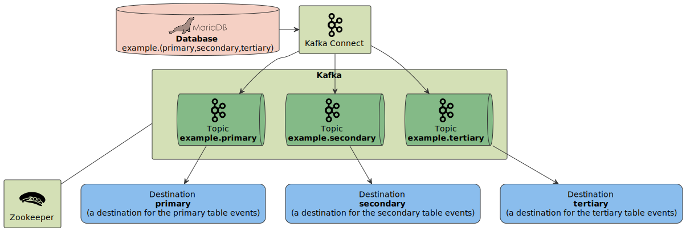

# Kafka Sandbox

This repository contains basic **Zookeeper**, **Kafka**, **Kafka Connect** and **MariaDB** configuration.

To run this example **Docker** installation is required.

## Diagram

## Makefile

Use `Makefile` to run all the examples. To list all available options run `make`.

## Instructions

- Run `make up` to start everything up.
- Run `make make kafka-connect-connectors` to configure `example` database connector.
- Run `make mariadb` to access database shell, run the below example SQL queries to create records. 
- Run `make kafka-consume-example-primary`, `make kafka-consume-example-secondary` or `make kafka-consume-example-tertiary` to consume database events.
- run `make mariadb-insert-primary`, `make mariadb-insert-secondary` or `make mariadb-insert-tertiary` to insert new records to the tables.
